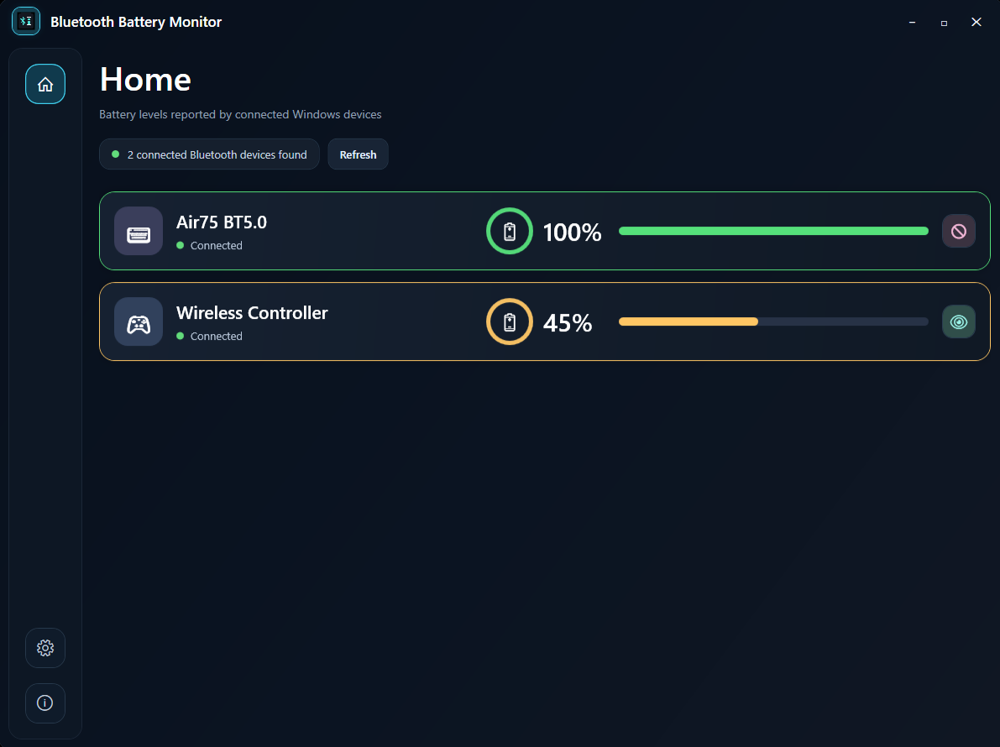
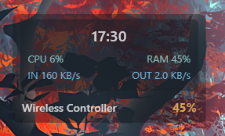
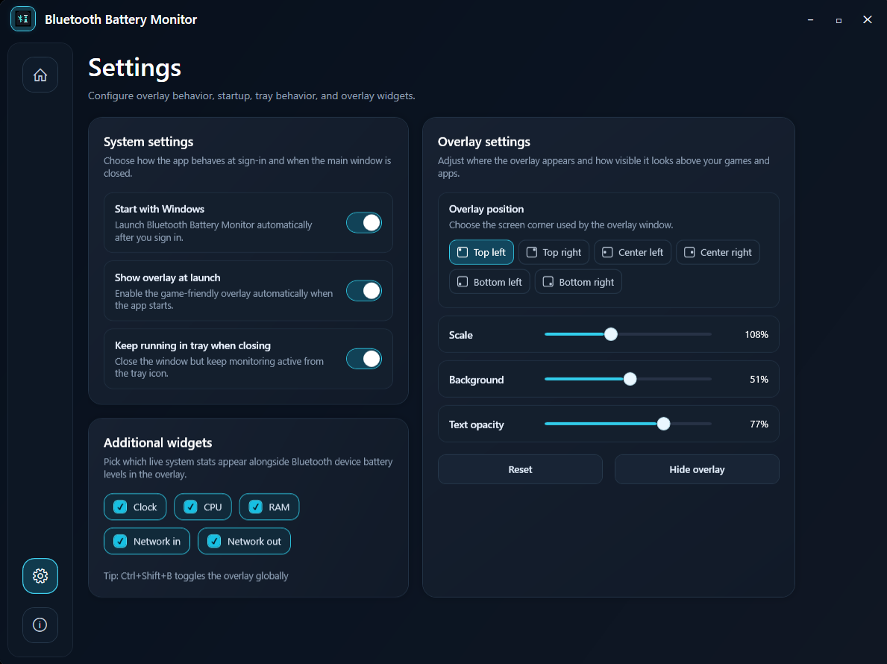
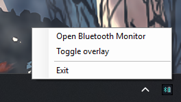

# Bluetooth Battery Monitor

A small Windows desktop app that shows battery levels for connected Bluetooth devices and selected wireless USB peripherals. It includes a click-through, always-on-top overlay intended for borderless/windowed-fullscreen games.



## Requirements

- Windows 10 version 2004 (build 19041) or newer
- [.NET 8 Desktop Runtime](https://dotnet.microsoft.com/download/dotnet/8.0) to run a framework-dependent publish
- A Bluetooth device/driver that reports its battery level to Windows, or a supported wireless USB device

Not every Bluetooth device exposes battery data. Such devices still appear, with `—` as their battery level. DualShock 4 controllers and SteelSeries Arctis 7+ headsets are handled specially: the app reads their battery directly from HID reports when Windows does not publish it. A lightning bolt marks devices that report active charging through Windows or a supported HID report. Supported Arctis 7+ variants use their 2.4 GHz USB dongle and appear while the headset is powered on. True exclusive-fullscreen games can render above normal desktop windows; choose borderless fullscreen for reliable overlay visibility. The app does not inject into games.

## Build and run

```powershell
dotnet restore BluetoothMonitor.sln
dotnet build BluetoothMonitor.sln --no-restore
dotnet test BluetoothMonitor.sln --no-build
dotnet run --project src/BluetoothMonitor/BluetoothMonitor.csproj --no-build
```

In VS Code, install the recommended C# extensions, press `Ctrl+Shift+B` to build, or press `F5` to build and debug the WPF executable. Run **Tasks: Run Test Task** for the test suite. Run the `Publish [win-x64]` task to create a release under `artifacts/win-x64`.

The workspace also includes `Restore`, `Test`, and `Run App` tasks for the common desktop loop. The launch profile in [.vscode/launch.json](/D:/Projects/bluetooth-monitor/.vscode/launch.json) starts `BluetoothMonitor.exe` from the Debug build output after the `Build [Debug]` task in [.vscode/tasks.json](/D:/Projects/bluetooth-monitor/.vscode/tasks.json).

## Using the overlay

Choose an overlay corner in **Settings**, then choose **Show overlay** or press `Ctrl+Shift+B` from anywhere. The selected corner is remembered between launches. The overlay does not steal focus and lets mouse input pass through to the game below it.

The main window uses a custom rounded window shell with explicit 8 px clipping to avoid dark-corner artifacts on Windows. The main window and overlay are designed to stay readable across common Windows display scaling values such as 100%, 125%, 150%, 175%, and 200%. On multi-monitor setups, the overlay uses the selected monitor working area instead of assuming the primary display.



## Settings

Customize the overlay position, scale, background and text opacity, and choose whether to show weather, now playing, anime info, the clock, CPU, CPU temperature, GPU temperature, RAM, and network activity. Weather, now playing, and anime info are enabled by default; the live system widget is opt-in. Now playing reads Windows media sessions, so it works with Spotify, its PWA, and other apps that publish media metadata. Opening and ending labels use the public AnimeThemes API; soundtrack labels remain a best-effort local classification when a track is not listed as an anime theme. The settings page also controls startup and tray behavior.

The Settings view starts in the correct responsive layout as soon as it opens, without requiring a manual resize first. Scrollable views also keep a small gap between the rightmost cards and the vertical scrollbar so content does not feel crowded.

### Now playing and anime info

The **Now playing** toggle controls the complete music widget. The separate **Anime info** toggle controls only the opening, ending, or soundtrack label, so the song title and artist can remain visible without anime classification. AnimeThemes is queried only when the track changes and results are cached locally for 12 hours. Japanese titles are matched using known romanized aliases, including titles with extra suffixes such as `- On The Way`. If the service is unavailable or the song is not indexed, the overlay keeps the track information and falls back to local metadata hints.

### Temperature configuration

CPU and GPU temperatures refresh once when the overlay opens and then only when their configured interval becomes stale. The default `Auto` mode uses LibreHardwareMonitor first and then falls back to Windows thermal-zone readings when the primary path cannot supply a CPU value.

If CPU temperature remains unavailable on your system, try `LibreHardwareMonitor only` versus `Windows thermal zones only` in **Temperature source**. The Windows thermal-zone fallback is fully native and requires no external log file, but some systems expose only generic ACPI zones rather than a dedicated package temperature. In `Auto`, missing CPU values can be filled from the native fallback while GPU values remain sourced from LibreHardwareMonitor when available.

The saved temperature settings live in `%LOCALAPPDATA%\BluetoothMonitor\settings.json` as `TemperatureDataSource` and `TemperatureRefreshSeconds`.

Overlay system-stat and temperature sampling now run off the UI thread before bound properties are updated, which reduces the short drag hitch that could previously appear at regular intervals while moving the main window.

### Weather configuration

Weather is enabled by default with `Rome, Italy` as the explicit initial location. In **Settings → Additional widgets**, enter a city or place name and press Enter or leave the field to validate it before saving, then choose a 5–60 minute refresh interval. The previous valid location is retained if validation fails. The saved user setting is stored in `%LOCALAPPDATA%\BluetoothMonitor\settings.json`; supported JSON values from 5 through 120 minutes are accepted. The overlay fetches immediately when opened and checks every 30 seconds, but calls the provider only when its configured interval has elapsed. Closing the overlay stops weather checks.

The app uses Open-Meteo's geocoding and current-weather endpoints, which do not require an API key. It does not use GPS, Windows location services, or IP-based location. If a keyed provider is introduced later, keep its key out of source and the settings JSON: use an environment variable, .NET user secrets for development, or the deployment's secret store.

The overlay shows its loading and error states inline. To manually validate those states, open the overlay after changing location; use an invalid place name for the not-found state, or disconnect the network for the unavailable state. Restore connectivity and reopen the overlay (or change the location) to force a retry.



## Tray icon

Minimizing the dashboard hides it to the notification area while monitoring continues. Closing the window exits the app by default, or can keep it in the tray if **Keep running in tray when closing** is enabled. Double-click the tray icon to reopen it. Its menu can open the dashboard, toggle the overlay, or exit the application completely.



## Start with Windows

The **Start with Windows** option is opt-in and remembered after the user checks it. **Show overlay at launch** is a separate option. Login startup uses the current executable through the current-user Run key, starts in the tray, and can show the overlay without opening the dashboard.

## GitHub releases

Pushes to `main` trigger `.github/workflows/release.yml`, which publishes a self-contained single-file `BluetoothMonitor.exe` for `win-x64`, creates a companion zip named `BluetoothMonitor-release-tag-arch.zip`, and uploads both to a dated GitHub Release. The zip contains a `BluetoothMonitor` folder with the executable inside, and the release page includes grouped notes plus a changelog link.
